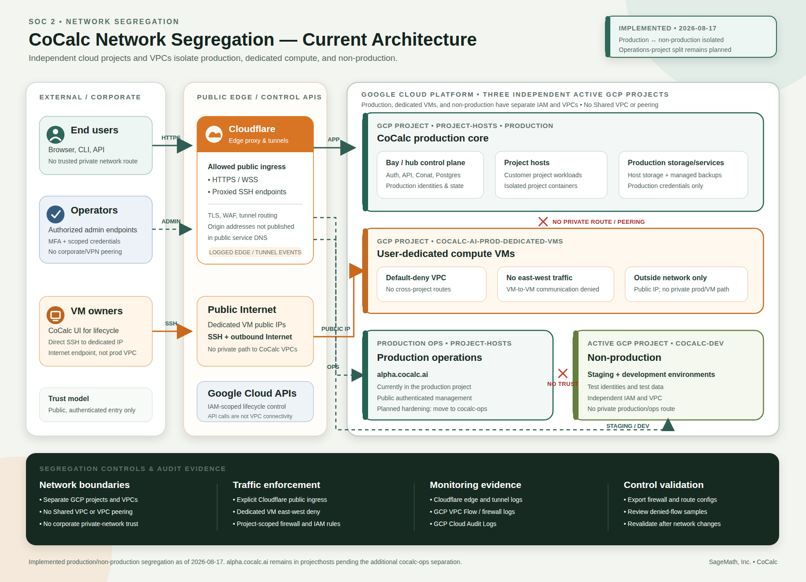

# CoCalc Network Segregation Current Architecture

**Document date:** 2026-08-17

**Status:** Implemented production/non-production segregation; additional
production-operations separation remains planned

## Scope

This diagram documents the current segregation among three active independent
Google Cloud projects and their VPC networks. It also records the planned
additional separation of production operations into `cocalc-ops`.

| Environment                | GCP project                    | Current contents and status                                                                                                        |
| -------------------------- | ------------------------------ | ---------------------------------------------------------------------------------------------------------------------------------- |
| Production core            | `project-hosts`                | Production bay/hub, Postgres, project hosts, production services, and currently `alpha.cocalc.ai` operations tooling               |
| Dedicated customer compute | `cocalc-ai-prod-dedicated-vms` | User-dedicated VMs with public Internet connectivity, no private path to CoCalc production, and no VM-to-VM east-west connectivity |
| Non-production             | `cocalc-dev`                   | Staging and development environments, with independent IAM and VPC networking                                                      |
| Production operations      | `cocalc-ops`                   | Planned destination for `alpha.cocalc.ai`; this project separation is not implemented yet                                          |

The three active projects do not use Shared VPC, VPC peering, private routing,
or corporate-network trust between them. GCP API calls authorized by
project-scoped IAM control infrastructure lifecycle; they do not establish VPC
connectivity. Production operations currently share the `project-hosts`
project and are therefore not represented as a separate network boundary.

## Allowed Network Flows

| Source                          | Destination                        | Allowed path                                         | Purpose                           |
| ------------------------------- | ---------------------------------- | ---------------------------------------------------- | --------------------------------- |
| End users                       | Production CoCalc services         | Public HTTPS/WSS through Cloudflare edge and tunnels | Application access                |
| Authorized operators            | Production and operations services | Public authenticated HTTPS/SSH through Cloudflare    | Administration                    |
| Dedicated VM owners             | Their dedicated VM                 | Public IP, principally SSH; outbound public Internet | Direct VM use                     |
| CoCalc production control plane | Google Cloud APIs                  | IAM-authenticated public Google API endpoints        | Dedicated VM lifecycle management |
| Developers/testers              | Staging and development services   | Public authenticated non-production endpoints        | Development and testing           |

All private cross-project paths are denied by absence of routes/peering and by
project firewall policy. The dedicated-VM VPC additionally denies east-west
traffic between VMs.

## Implementation Status

As of the document date, production and non-production are operationally
segregated:

- the active staging bay, staging project host, and development VMs run in
  `cocalc-dev`;
- staging and development use service accounts in `cocalc-dev`; the former
  staging/development-specific service accounts in `project-hosts` have been
  deleted;
- no active staging or development workload runs in the production VPC;
- the former `projecthosts/staging-bay-0` VM is terminated and
  deletion-protected for a short rollback window. It does not receive staging
  traffic and should be deleted with its obsolete ingress resources after the
  rollback window;
- `alpha.cocalc.ai` still runs in `project-hosts`. Moving it to a new
  `cocalc-ops` project remains a planned defense-in-depth improvement, not a
  completed boundary.

This diagram is suitable as implementation evidence for segregation of
production from development and staging. It deliberately does not claim that
production operations have already moved to `cocalc-ops`.

## Supporting Evidence To Attach

1. GCP project and VPC inventory showing the three active independent projects,
   plus `cocalc-ops` after that planned project is provisioned.
2. Route and VPC-peering exports showing no cross-project private routes,
   Shared VPC, or peering.
3. Firewall exports for each VPC, including the dedicated-VM east-west deny
   policy and the explicit allowed ingress rules.
4. Project-scoped service-account/IAM exports for infrastructure lifecycle
   operations.
5. Recent GCP VPC Flow Logs, firewall logs, and Cloud Audit Logs demonstrating
   the expected allowed and denied flows.
6. Cloudflare tunnel/DNS configuration and recent edge or tunnel logs for
   production and operations ingress.
7. A dated validation note confirming active staging and development workloads
   are in `cocalc-dev`, along with the terminated state of the retained staging
   rollback VM.
8. After the operations migration, an updated inventory confirming
   `alpha.cocalc.ai` is in `cocalc-ops` and obsolete `projecthosts` rollback
   resources have been removed.

The SVG is the editable source. The PNG is intended for direct upload to Vanta.
