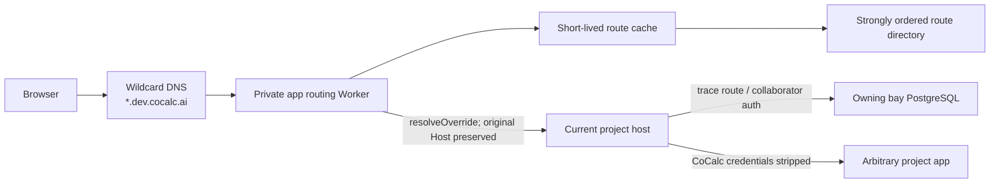
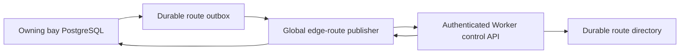

# Private App Wildcard Edge Routing

Status: deferred implementation specification

Last updated: 2026-07-28

This document specifies the eventual replacement for CoCalc's current
one-Cloudflare-DNS-record-per-private-app implementation. It is intentionally a
future plan. Do not begin this migration until the development/production split
and higher-priority project-host reliability work are complete.

Related documents and code:

- `src/.agents/workspace-runtime-private-dev-sites-plan-2026-07-26.md`
- `src/.agents/scalable-architecture.md`
- `src/.agents/app-server.md`
- `src/packages/server/app-private-hostnames.ts`
- `src/packages/project-host/private-app-hostname.ts`
- `src/packages/project-host/http-proxy-auth.ts`
- `src/packages/server/cloud/dns.ts`

## Executive Decision

Keep the current per-app proxied CNAME implementation for the initial
admin/pro-only release. Its membership-tier limits and per-bay safety ceiling
are adequate for the present small audience.

Before this becomes a broad customer feature, replace per-app DNS records with:

1. one dedicated wildcard namespace per site, such as
   `*.dev.cocalc.ai`;
2. one proxied wildcard DNS record for that namespace;
3. one fail-closed Cloudflare Worker route for every path on that namespace;
4. a strongly ordered edge route directory keyed by the random hostname label;
5. the existing project host as the authenticated app-proxy boundary.

The Worker is a routing layer, not an authorization layer. PostgreSQL in the
project's owning bay remains the durable source of truth. The project host
continues to verify collaborator access, rewrite the private hostname to the
canonical app path, and consume all CoCalc credentials before forwarding the
request to the arbitrary app.

This design has a DNS record count that is constant in the number of private
apps. Membership-tier limits remain useful product, abuse, and cost controls,
but they are no longer constrained by Cloudflare's DNS record quota.

## Why This Is Deferred

The current implementation is working on staging and supports:

- reservation and release;
- membership-tier project limits;
- project-host move reconciliation;
- HTTP and WebSocket traffic;
- path-transparent generic app proxying;
- collaborator authorization and revocation;
- platform credential stripping before the app.

The current audience is deliberately small. As of this plan, only four admins
and four pro memberships can realistically exercise the feature. A wildcard
edge router is therefore not an outage fix or an immediate release blocker.

The wildcard design introduces a new globally deployed data-plane component,
edge state projection, certificate provisioning, and a migration protocol.
Those deserve focused implementation and staging soak after the current
dev/prod split is complete.

## Current Baseline

The existing implementation stores one row per `(project_id, app_id)` in the
project's owning bay:

```text
project_app_private_hostnames
  project_id
  app_id
  label
  hostname
  base_path
  dns_record_id
  dns_target
  created_by
  created_at
  updated_at
  last_dns_error
```

Reservation creates a random `dev-<16 hex digits>` label and a proxied CNAME to
the project's current stable project-host hostname. Release deletes Cloudflare
DNS before deleting the database row. Placement changes reconcile the CNAME
target.

The current limits are:

- a hard maximum of 30 private app hostnames per project;
- a membership entitlement named
  `features.private_app_hostnames_per_project`;
- a configurable per-bay DNS safety ceiling, currently defaulting to 3,000.

The membership limit must survive the wildcard migration. The per-bay DNS
ceiling becomes a legacy-mode-only setting.

## Problem Statement

Cloudflare currently limits Pro and Business zones to 3,500 DNS records.
Creating one record for every private app cannot support broad use, and separate
bay databases cannot safely enforce a single zone-wide counter.

A DNS wildcard alone does not solve routing. It sends every matching hostname
to one origin and cannot choose a project host from the random app label.

A wildcard per project host is also wrong:

- it would bind the public URL to mutable project placement;
- a project move would change the URL or require another directory anyway;
- nested hostnames require additional wildcard certificate coverage;
- DNS cannot dynamically select a host from an app label;
- the number of wildcard records would still grow with the host fleet.

The missing component is a small edge directory lookup that chooses the current
stable project-host origin for each random app hostname.

## Goals

1. Make DNS and Worker route count constant as private app count grows.
2. Preserve stable private app URLs across project-host moves and preemptions.
3. Proxy arbitrary HTTP and WebSocket applications without modifying them.
4. Keep steady-state app bytes off hubs and control-plane bays.
5. Keep project-host collaborator authorization as the final authority.
6. Fail closed on unknown, released, stale, or malformed routes.
7. Make reserve, release, move, and cross-bay rehome idempotent and recoverable.
8. Preserve current membership-tier controls and Apps UI behavior.
9. Permit an incremental migration with immediate rollback to legacy DNS mode.
10. Provide enough diagnostics to distinguish edge, directory, host-route, app,
    and authorization failures.

## Non-Goals

This project does not:

- make private apps public or anonymous;
- add customer-owned custom domains;
- move CoCalc account or collaborator authorization into Cloudflare;
- proxy app traffic through a hub;
- replace stable project-host public routes;
- implement Workers for Platforms or one Worker per customer app;
- add arbitrary caller-selected origins;
- remove membership limits;
- migrate existing URLs without an explicit compatibility policy.

## Required Security Invariants

These invariants are release blockers.

1. A random hostname is an identifier, not an authorization credential.
2. The Worker may route only to a canonical, platform-managed project-host
   origin from the edge directory.
3. A request never supplies or overrides its own target origin, project ID, app
   ID, bay ID, host ID, or route generation.
4. Unknown and revoked labels fail closed without revealing project or app
   metadata.
5. The project host independently resolves the hostname and verifies that the
   route is active and currently assigned to that project host.
6. The project host verifies current collaborator access for HTTP and
   WebSocket traffic using the existing private-hostname authorization path.
7. Collaborator revocation continues to close established WebSockets through
   the existing revocation sweep.
8. CoCalc bearer tokens, bootstrap tokens, browser-session cookies, and
   project-host routing headers are consumed before proxying to the user app.
9. No outer CoCalc credential or internal route assertion reaches the user app.
10. Client-supplied internal routing headers are removed before any trusted
    edge or project-host header is added.
11. The edge control API is separate from the public app route and requires
    authenticated, replay-protected mutation requests.
12. Route update targets are validated against the canonical project-host
    directory. The control plane cannot publish an arbitrary URL or IP.
13. The Worker route and its fallback origin are fail closed. A Worker failure
    must not bypass the Worker to a real hub or project host.
14. The wildcard namespace has no public-app or anonymous fallback.
15. Released random labels are never reused.
16. Stale edge state may cause a temporary failed request, but it must never
    authorize a request or expose another project.
17. Requests for unknown labels do not create Durable Object storage or any
    other durable resource.
18. Unknown-label scanning is rate-limited before it can become an unbounded
    Durable Object request-cost attack.

## Target Topology



Control-plane mutations are separate:



The hub or bay is involved when a route changes. It is not involved in normal
HTTP, upload, download, terminal, Jupyter, Socket.IO, or WebSocket traffic.

## Namespace and Cloudflare Resources

### Dedicated Namespace

Use a dedicated namespace in the same Cloudflare zone as the stable project
hostnames:

```text
<random-label>.<private-app-namespace>
```

Example production configuration:

```text
private-app-namespace = dev.cocalc.ai
hostname              = dev-b8124f83de2221cb.dev.cocalc.ai
```

Staging must use a distinct namespace and Worker deployment, for example:

```text
dev.staging.cocalc.ai
```

The exact names should be selected as part of the dev/prod split. The important
properties are:

- production and staging do not share route state, secrets, Worker versions,
  Durable Object namespaces, or wildcard routes;
- the private app namespace is dedicated to this feature;
- the namespace and all stable project-host origins are in the same Cloudflare
  zone so `resolveOverride` is honored;
- an app hostname has exactly one random label before the configured namespace.

Do not attach the Worker to `*.cocalc.ai`. Worker route patterns do not support
an infix hostname pattern such as `dev-*.cocalc.ai`, so that route would
intercept unrelated CoCalc subdomains. A dedicated namespace keeps the route's
blast radius bounded.

### DNS

Provision exactly one proxied wildcard record per site:

```text
*.dev.cocalc.ai CNAME private-app-fail-closed-origin.cocalc.ai
```

The CNAME target is a dedicated sink origin that always returns a generic
failure. It must not be a hub, project host, tunnel, or customer app.

The wildcard record exists so Cloudflare can invoke a Worker route. The Worker
selects the actual project-host origin with `resolveOverride`; the wildcard
CNAME target is not the normal data path.

Exact records under the namespace take precedence over wildcard DNS. Provision
and periodic audit must reject unexpected exact records, delegations, or
conflicting route patterns under the namespace.

### Worker Route

Use a Route, not a Worker Custom Domain:

```text
https://*.dev.cocalc.ai/*
```

Cloudflare Worker Custom Domains do not support wildcard DNS. Route mode is
also the mode intended for a Worker that runs in front of an existing origin.

Configure the route to fail closed. If the Worker cannot execute, traffic must
reach only the fail-closed sink origin.

### Edge TLS

Cloudflare Universal SSL on a full zone covers the apex and first-level
subdomains, not arbitrary deeper wildcard namespaces. A hostname such as
`x.dev.cocalc.ai` therefore requires explicit edge certificate coverage for:

```text
*.dev.cocalc.ai
```

Use Total TLS, Advanced Certificate Manager, or a custom certificate. The
provisioner must verify active edge coverage before enabling the Worker route.
DNS success alone is not an acceptable readiness signal.

### Origin TLS

The preferred routing mechanism is:

```ts
fetch(request, {
  cf: {
    resolveOverride: route.origin_hostname,
  },
});
```

`resolveOverride` selects the stable project-host origin while preserving the
original app hostname in the URL and `Host` header. This lets the current
project-host private-hostname tracer and path-transparent proxy operate without
application-specific rewriting at Cloudflare.

Before production, verify the exact Cloudflare edge-to-origin SNI and
certificate behavior in staging. The target end state is Full (strict) TLS
with origin certificate coverage appropriate for the private app namespace.
Do not make permanent reliance on Full/non-strict TLS part of this design.

If strict TLS cannot be made compatible with `resolveOverride`, stop and write a
separate security review for the alternative:

1. fetch the stable project-host URL directly;
2. carry the original private hostname in a short-lived signed edge assertion;
3. verify the assertion at the project host;
4. strip it before the app.

That alternative is not part of the first implementation because it creates a
new trusted ingress protocol and key-rotation surface.

## Route Data Model

### Owning-Bay Source of Truth

Evolve `project_app_private_hostnames` through a proper migration rather than
runtime `CREATE TABLE` changes.

Proposed additional columns:

```sql
route_id UUID NOT NULL;
routing_mode TEXT NOT NULL DEFAULT 'legacy-dns';
route_state TEXT NOT NULL DEFAULT 'active';
edge_generation BIGINT NOT NULL DEFAULT 0;
edge_target_host_id UUID;
edge_target_hostname TEXT;
edge_synced_generation BIGINT;
edge_synced_at TIMESTAMPTZ;
edge_last_error TEXT;
released_at TIMESTAMPTZ;
```

Allowed routing modes:

```text
legacy-dns
edge-wildcard
```

Allowed route states:

```text
pending
active
moving
releasing
released
error
```

The row remains project-owned authoritative data in the owning bay. The edge
directory is a projection used only to choose a network origin.

`edge_generation` is monotonically increasing for every reserve, target
change, release, or ownership handoff. It must move with the route across bays.
Generation comparisons, not arrival order, decide whether an edge mutation is
newer.

### Edge Projection

The public Worker needs only:

```ts
interface EdgePrivateAppRoute {
  schema_version: 1;
  label: string;
  generation: string;
  state: "active" | "revoked";
  target_host_id?: string;
  origin_hostname?: string;
  updated_at: string;
}
```

Do not place account IDs, project IDs, app IDs, collaborator information, or
tokens in the public edge lookup response. The Worker does not need them.

The route's Durable Object may retain additional control metadata:

```ts
interface EdgePrivateAppRouteControl {
  owning_bay_id: string;
  route_id: string;
  last_command_id: string;
}
```

That metadata is not returned by the public lookup path.

### Durable Object Choice

Use one Durable Object identity per random hostname label for the first
implementation.

Reasons:

- mutations for one hostname are serialized;
- storage is strongly consistent;
- labels do not contend with unrelated labels;
- stale generations and duplicate commands are easy to reject;
- release tombstones can prevent delayed recreation;
- the design scales horizontally without a single global directory process.

The object stores one small current route record and an audit tail bounded to a
small fixed number of commands.

Looking up a never-provisioned label must return `unknown` without writing
storage. Merely constructing a Durable Object stub or invoking an object must
not leave a persistent row, audit event, alarm, or tombstone for an attacker
chosen label.

Do not use Workers KV as the sole route authority. KV is eventually consistent,
including for negative lookups, and changes can take 60 seconds or longer to
become visible in another Cloudflare location. That is useful for caching but
not sufficient for mutation ordering or revocation tombstones.

### Route Lookup Cache

A Durable Object lookup on every static asset and WebSocket frame setup would
add avoidable latency and cost. The Worker may cache active route projections
for at most 15 seconds in `caches.default` or a bounded isolate-local cache.

Rules:

- active entries have a maximum 15-second TTL;
- unknown entries have a maximum 1-second TTL;
- revoked entries may be cached for 15 seconds;
- cache content is routing metadata, never authorization state;
- cache staleness may cause a temporary failure but never grants access;
- the project host always verifies active route state and current host
  assignment independently;
- begin staging with a 0-second cache to establish correctness, then enable and
  measure 5-second and 15-second TTLs;
- do not add Workers KV until measured traffic proves the Worker/DO cache is
  insufficient.

The project host's existing 30-second hostname cache must gain explicit
invalidation on route release and placement changes. A missed invalidation may
fall back to the bounded TTL, but origin authorization must never trust edge
state by itself.

### Permanent Tombstones

Released labels are never reused. Their Durable Objects retain a compact
`revoked` tombstone with the highest generation.

Keeping the tombstone prevents a delayed or duplicated old `activate` command
from recreating a released route. Tombstone garbage collection is out of scope
for the first version. It may be added only with a proof that no older command
can arrive and a separate permanent used-label registry remains.

## Multibay Authority and Publishing

### Authority

The project's `owning_bay_id` determines which bay may create the authoritative
route mutation. A browser's home bay and the project host are not route
authorities.

Launchpad uses the same path with its single local bay.

### Durable Outbox

Do not dual-write PostgreSQL and Cloudflare in one request and pretend it is
atomic. Add a durable outbox in the owning bay.

Each command includes:

```ts
interface PrivateAppEdgeCommand {
  command_id: string;
  route_id: string;
  label: string;
  owning_bay_id: string;
  generation: string;
  operation: "activate" | "move" | "revoke" | "handoff";
  target_host_id?: string;
  origin_hostname?: string;
  created_at: string;
}
```

The outbox worker retries with bounded exponential backoff. Commands are
idempotent. A command with a generation lower than the Durable Object's current
generation is acknowledged as stale and makes no change.

### Global Edge-Route Publisher

Use one logical edge-route publisher per site:

- in Rocket it belongs to the small global/directory layer;
- in Launchpad it can run in the single bay;
- it consumes authenticated inter-bay outbox messages;
- it verifies current owning bay and canonical host placement;
- it validates that `origin_hostname` is the registered stable hostname for
  `target_host_id`;
- it calls the Worker control API;
- it records acknowledgements back in the owning bay.

This service centralizes mutation credentials, not app traffic. It does not sit
in the data path.

The publisher is the only component holding the Worker control credential.
Project hosts, projects, user apps, and browsers never receive it.

### Worker Control API

Expose control operations on a separate exact hostname or Cloudflare service,
not under the public wildcard app route.

Requirements:

- `workers.dev` access disabled;
- Cloudflare Access service authentication or mTLS;
- an application-level signed request with timestamp, nonce, body digest, and
  command ID;
- replay rejection;
- strict JSON schema validation;
- no caller-selected arbitrary URL;
- generation comparison inside the Durable Object transaction;
- structured, idempotent responses;
- an audit event for accepted, duplicate, stale, and rejected commands.

The control API must not expose list-all-routes or route metadata to public
clients.

## Public Worker Request Algorithm

For every HTTP request or WebSocket upgrade:

1. Parse and lowercase the `Host` header.
2. Require exactly one label before the configured namespace.
3. Require the current random label format. Initially this is
   `dev-[0-9a-f]{16}`.
4. Reject the namespace apex, nested labels, Unicode ambiguity, ports in the
   normalized name, and malformed hostnames.
5. Remove all client-supplied `X-CoCalc-Edge-*` and other reserved internal
   routing headers.
6. Read a short-lived route projection from cache or the label's Durable
   Object.
7. Return the same generic 404 response for unknown and revoked routes.
8. Validate `target_host_id` and `origin_hostname` against strict syntax and
   configured same-zone suffixes.
9. Clone the request without changing method, body, path, query, ordinary
   headers, cookies, upgrade headers, or streaming behavior.
10. Fetch with `resolveOverride=origin_hostname`, preserving the original URL
    and `Host`.
11. Stream the origin response without buffering.
12. Preserve `101 Switching Protocols` and WebSocket pass-through behavior.
13. Never follow or rewrite redirects in the Worker.
14. Never cache application responses merely because the route mapping was
    cached.

The existing project-host response rewrite remains responsible for converting
canonical internal app redirects back to the private hostname root.

Apply Cloudflare WAF/rate-limit rules to malformed and unknown-label traffic.
Rate limits should combine source, hostname, and aggregate namespace signals so
an attacker cannot evade them only by choosing a new random label per request.
Known active routes must not share an overly small global bucket with scans.
Alert on sustained unknown-label rates and unexpected Durable Object request
growth.

## Project-Host Changes

The Worker must not weaken project-host checks. Extend the existing private
hostname trace result to include:

```ts
interface PrivateAppHostnameTrace {
  matched: boolean;
  project_id?: string;
  app_id?: string;
  base_path?: string;
  route_state?: string;
  route_generation?: string;
  current_host_id?: string;
}
```

Before rewriting:

1. `route_state` must be `active`;
2. `current_host_id` must equal the receiving project host;
3. the project must still be assigned to and runnable on this host;
4. normal private-hostname collaborator authorization must succeed.

An old host that receives a stale edge route after a project move must return a
generic unavailable/not-found response. It must not forward locally or proxy
to the new host.

Keep the existing guarantees:

- the private hostname claims the entire origin namespace;
- HTTP and WebSocket routing are serialized through the same rewrite barrier;
- ordinary app paths such as `/`, `/conat`, `/socket.io`, `/healthz`, and
  arbitrary framework routes remain unmodified externally;
- public-app authorization is never used;
- CoCalc auth cookies and internal headers are stripped at the final app proxy
  boundary.

## Lifecycle Protocols

### Reserve

1. Authorize the owner/admin mutation using the current API.
2. Enforce the project usage account's membership-tier limit.
3. Generate a never-before-used random label.
4. Insert the owning-bay row as `edge-wildcard`, `pending`, generation 1.
5. Insert an `activate` command in the same PostgreSQL transaction.
6. The publisher verifies owning bay, project placement, host identity, and
   origin hostname.
7. The Durable Object stores the active generation and acknowledges.
8. Mark the database row `active` only after the edge acknowledgement.
9. Invalidate project-host hostname caches.
10. Run authenticated HTTP and WebSocket synthetic probes.
11. Return the URL as ready only after the HTTP probe succeeds. A probe timeout
    leaves visible retryable state instead of allocating a second label.

There is a safe interval in which the edge route exists while the database row
is still pending. The project host treats pending as absent, so requests fail
closed.

### Release

1. Mark the owning-bay row `releasing` and increment generation in a
   transaction.
2. Project-host tracing immediately treats the route as absent.
3. Publish cache invalidation to current and recently assigned hosts.
4. Insert a `revoke` outbox command in the same transaction.
5. The Durable Object writes a permanent revoked tombstone.
6. Mark the row `released` after acknowledgement.
7. Remove the route from the Apps UI while retaining release diagnostics.
8. Delete or archive the database row only according to a later retention job;
   never reuse the label.

If Cloudflare is unavailable, release remains visibly pending. The owning-bay
row is already non-active, so the project host denies access even if an edge
cache temporarily routes a request to it.

### Project-Host Move

1. Change project placement in the owning bay.
2. In the same control workflow, mark each active private route `moving`,
   increment generation, and enqueue a `move` command.
3. Old project hosts reject the route because `current_host_id` no longer
   matches.
4. Start and validate the project on the new host.
5. Publish the new canonical stable host origin.
6. Mark routes active after edge acknowledgement.
7. Probe HTTP and WebSocket paths through the public wildcard hostname.

A short fail-closed interruption is acceptable. Serving the old project or
guessing between hosts is not.

Host preemption with unchanged placement should require no edge update. The
edge route points to the stable project-host hostname, while existing host
public-route reconciliation updates that hostname's address after restart.

### App Delete

App deletion must use the release protocol before destructive app metadata
cleanup. A failed edge revoke leaves a retryable released route, not a live
route detached from its app.

### Project Hard Delete

Project hard delete:

1. marks all routes releasing;
2. creates revoke commands transactionally;
3. waits for acknowledgement or records explicit blocked cleanup state;
4. retains edge tombstones after project rows are removed.

No hard-delete code may silently discard an unacknowledged route mutation.

### Cross-Bay Rehome

The wildcard architecture should make private routes portable instead of
requiring release and re-reservation.

The rehome protocol must:

1. freeze private-route mutations with the project;
2. copy the route rows, route IDs, labels, states, and generations;
3. have the global publisher verify the project directory's new owning bay;
4. issue a generation-incrementing `handoff` command;
5. update target placement if the project also changes host;
6. allow only the destination bay to publish later generations;
7. unfreeze the destination rows after edge acknowledgement.

The hostname remains unchanged. No browser redirect or DNS mutation is needed.

## Membership, Limits, and UI

Keep the existing entitlement:

```text
features.private_app_hostnames_per_project
```

The initial defaults can remain:

| Membership | Per-project limit |
| ---------- | ----------------: |
| free       |                 0 |
| basic      |                 2 |
| student    |                 2 |
| standard   |                 5 |
| instructor |                 5 |
| pro        |                30 |
| admin      |                30 |

The value remains editable in `/admin/membership-tiers`.

After wildcard migration:

- retain a hard sanity maximum until abuse and Worker cost are understood;
- remove DNS quota language from the entitlement;
- apply the limit to active plus pending routes;
- allow existing routes to be inspected and released after a tier downgrade;
- do not let an admin collaborator bypass the project usage account's tier;
- hide reserve UI when the site lacks a ready wildcard edge deployment;
- continue showing existing route state and release controls when allocation is
  disabled.

Add site settings:

```text
project_hosts_app_private_hostname_routing_mode
  legacy-dns | edge-wildcard | dual-shadow

project_hosts_app_private_hostname_edge_namespace
project_hosts_app_private_hostname_edge_ready
project_hosts_app_private_hostname_edge_cache_ttl_s
project_hosts_app_private_hostname_edge_control_url
```

Secrets belong in the existing secret-setting UI and secret storage, not plain
site settings.

`project_hosts_app_private_hostname_bay_limit` applies only to
`legacy-dns`. Keep it during migration and remove it only after the final legacy
record is gone.

## Deployment Layout

Add a dedicated package, tentatively:

```text
src/packages/private-app-edge-router/
  package.json
  wrangler.jsonc
  src/worker.ts
  src/route-object.ts
  src/control-auth.ts
  src/types.ts
  test/
```

The package should:

- use a pinned Wrangler/workerd toolchain;
- produce separate staging and production deployments;
- declare Durable Object migrations explicitly;
- disable `workers.dev`;
- define CPU limits;
- expose deploy, dry-run, typecheck, and local integration test commands;
- generate no Cloudflare resources implicitly during a normal monorepo build.

Infrastructure provisioning should be idempotent code in the existing managed
Cloudflare control layer, not a dashboard-only checklist. It must reconcile:

- wildcard DNS;
- fail-closed origin;
- Worker script/version;
- Worker route;
- Durable Object namespace binding;
- edge certificate coverage;
- control hostname and authentication;
- observability destination;
- environment-specific secrets.

Production deploys must use immutable Worker versions and staged rollout, not
an unversioned direct edit in the Cloudflare dashboard.

## Observability

### Worker Metrics

Record:

- requests by site, status, and protocol;
- route-cache hit/miss rate;
- Durable Object lookup latency;
- origin connect and total response latency;
- WebSocket upgrade success/failure;
- unknown/malformed/revoked label counts;
- rate-limited unknown-label scans;
- origin timeout and TLS failures;
- rejected origin target validation;
- Worker exception and CPU time;
- response byte counts when available.

Do not log full query strings, cookies, bearer tokens, bootstrap tokens, or
application request bodies.

### Control Metrics

Record:

- pending outbox commands by bay and age;
- accepted, duplicate, stale, and rejected generations;
- edge acknowledgement latency;
- routes by state and routing mode;
- target mismatches;
- release and move backlog;
- synthetic probe results;
- tombstone count;
- control authentication and replay failures.

### Project-Host Metrics

Record:

- private route trace latency and cache hit rate;
- inactive-route denial;
- receiving-host/current-host mismatch;
- collaborator denial;
- HTTP and WebSocket authorization failures;
- internal credential/header stripping assertions;
- route-cache invalidation delivery and fallback expiry.

### Alerts

Page or notify operators for:

- wildcard route or DNS missing;
- fail-closed origin unexpectedly serving non-sink content;
- edge certificate expiring or not covering the namespace;
- control outbox oldest age above threshold;
- sustained Worker exceptions or origin TLS failures;
- edge target/host identity mismatch;
- release commands unable to tombstone;
- correlated synthetic failures across hosts;
- production Worker version differing from the declared deployment.

Add an admin diagnostic that reports, without secrets:

```text
site edge deployment/version
namespace and certificate state
route mode
route ID, state, and generation
edge-synced generation
current target host ID/hostname
last command/error/probe
legacy DNS record state
```

## Testing Requirements

### Worker Unit Tests

Cover:

- hostname normalization and exact namespace matching;
- malformed, nested, Unicode, apex, unknown, and revoked hostnames;
- stale and duplicate generations;
- permanent tombstone behavior;
- strict origin allowlist validation;
- reserved-header stripping;
- path, query, method, body, streaming, and redirect transparency;
- HTTP and WebSocket pass-through;
- control authentication, expiry, nonce, and replay rejection;
- cache TTL bounds and no application-response caching;
- fail-closed behavior on directory exceptions.

Use Miniflare/workerd or Cloudflare's supported local Worker test runtime rather
than mocking every runtime API.

### Server Tests

Cover:

- transactional row plus outbox creation;
- membership limits under concurrent reservation;
- idempotent reserve/release/move;
- host placement changes during publication;
- current-host identity enforcement;
- route-state cache invalidation;
- app delete and hard-delete blocking semantics;
- stale acknowledgement handling;
- publisher restart and outbox replay;
- cross-bay handoff and generation preservation.

### Staging End-to-End Matrix

Test at least:

- a simple generic HTTP app;
- CoCalc workspace dev server;
- JupyterLab with its own base path;
- code-server;
- Socket.IO;
- raw WebSocket echo;
- large upload and download;
- streaming response;
- redirects, cookies, and same-origin API requests;
- browser-session bootstrap;
- signed-out and non-collaborator denial;
- collaborator removal with an established WebSocket;
- project stop/start;
- project-host preemption with unchanged placement;
- project move during active use;
- app release during active use;
- project hard delete;
- cross-bay rehome;
- Worker, Durable Object, publisher, bay, and origin outages;
- wrong-host and stale-generation fault injection.

Verify with browser automation that the browser remains at the private hostname
root and never sees the project ID, host ID, internal base path, or stable
project-host origin in navigation.

### Security Review

Before production, explicitly test:

- SSRF attempts through forged hostnames, headers, and control payloads;
- client spoofing of every internal edge/project-host header;
- replayed and reordered route mutations;
- stale active mappings after release;
- old-host routing after a move;
- credential and cookie leakage into a generic echo app;
- absolute and relative redirect escape;
- cache poisoning and cache-key confusion;
- route enumeration and metadata leakage;
- unknown-label Durable Object cost amplification;
- bypass of the Worker through DNS, direct origin IP, `workers.dev`, or another
  Cloudflare hostname.

## Rollout Plan

### Phase 0: Prerequisites

- Finish the intended development/production split.
- Stabilize current project-host public-route restart recovery.
- Keep the existing private app feature limited to admins/pro users.
- Add current DNS quota usage monitoring.
- Confirm the current legacy release/reconcile path has no orphaned records.

Exit gate: no wildcard code is carrying production traffic.

### Phase 1: Worker and Directory in Staging

- Create the dedicated staging namespace and edge certificate.
- Deploy the fail-closed origin, Worker route, and Durable Object namespace.
- Implement control authentication and a manual route mutation tool.
- Run generic HTTP/WebSocket transparency tests.
- Start with route caching disabled.

Exit gate: malformed and unknown traffic fails closed, generic apps work
unmodified, and strict origin TLS is verified.

### Phase 2: Owning-Bay Projection

- Add schema migration, route generations, state, and durable outbox.
- Add the global publisher and acknowledgements.
- Add project-host current-host enforcement and cache invalidation.
- Implement reserve, release, move, app delete, and hard delete.
- Enable a short measured cache TTL.

Exit gate: fault-injected retries, stale commands, and release all converge
without unauthorized access.

### Phase 3: Dual Shadow

For newly selected staging routes:

- keep the legacy per-app CNAME active;
- publish the same route to the edge directory;
- do not send user traffic through the wildcard namespace yet;
- compare the legacy DNS target with the Worker decision;
- run continuous authenticated HTTP and WebSocket probes through both paths.

`dual-shadow` is a comparison mode, not an attempt to serve one hostname
through two origins.

Exit gate: zero unexplained target divergence through project moves and host
restarts.

### Phase 4: Staging Default

- Allocate new staging routes in `edge-wildcard` mode.
- Keep existing legacy URLs unchanged.
- Complete the full end-to-end and security matrices.
- Soak for at least one week including host preemptions and hub restarts.

Exit gate: no unresolved security, route-staleness, TLS, WebSocket, or deletion
issues.

### Phase 5: Production Canary

- Deploy a separate immutable production Worker version and Durable Object
  namespace.
- Enable only for administrators and an explicit project allowlist.
- Retain the legacy allocator as immediate fallback for new routes.
- Monitor cost, latency, errors, outbox age, and origin mismatches.

Exit gate: canary remains healthy through real host restarts and project moves.

### Phase 6: New-Route Default

- Make wildcard routing the default for new eligible private URLs.
- Leave all existing legacy URLs working.
- Expand membership eligibility only after capacity and abuse review.
- Keep the routing-mode kill switch.

### Phase 7: Legacy Retirement

Choose one explicit compatibility policy:

1. keep legacy URLs until users release them; or
2. allocate replacement wildcard URLs, show a deprecation period, and remove
   legacy DNS only after confirmation.

Do not silently change an existing hostname.

Remove per-app DNS creation and the per-bay DNS ceiling only after:

- no active legacy rows remain;
- orphan scans find no owned legacy DNS records;
- the rollback window has closed;
- the Worker deployment has completed a production soak.

## Rollback

The routing mode is the primary rollback control:

```text
legacy-dns
edge-wildcard
dual-shadow
```

If the wildcard system is unhealthy:

1. disable new edge allocations;
2. keep existing edge routes fail closed or serving their last valid target;
3. continue ordinary authenticated path-based app access;
4. allocate legacy CNAMEs for a small explicit emergency canary set if DNS
   capacity permits;
5. repair or roll back the Worker to the last immutable healthy version;
6. replay the durable outbox and reconcile generations;
7. never route the wildcard namespace to a default project host or hub.

The legacy allocator remains in the codebase until Phase 7 completes.

Rollback must not delete Durable Object tombstones or reset generations.

## Cost and Capacity

The wildcard design uses a constant number of DNS records:

- one wildcard record;
- one fail-closed origin record;
- one control hostname record;
- any certificate-validation records required by the chosen certificate.

Cloudflare Workers Standard currently includes 10 million requests per month
and charges per additional request and CPU time. A proxied WebSocket is billed
for its initial upgrade request; messages are not counted as Worker requests.
Measure actual static asset request volume before expanding eligibility.

Durable Objects should be horizontally distributed by label. The short route
cache should remove most repeated metadata lookups for asset-heavy apps. Keep
membership limits and reserve-rate limits even after DNS capacity is no longer
the constraint.

Do not adopt Workers for Platforms unless later requirements include
customer-provided code or custom domains. A single ordinary routing Worker is
enough for platform-managed random subdomains.

## Operational Readiness Checklist

Before enabling production wildcard allocation, all answers must be yes:

- Is staging/prod edge state physically and logically separate?
- Does wildcard DNS resolve only through the intended proxied route?
- Does the namespace have active edge certificate coverage?
- Is edge-to-origin TLS strict and verified?
- Does route absence or Worker failure reach only a fail-closed sink?
- Does the Worker reject arbitrary origins and internal-header spoofing?
- Does the project host independently enforce active route and current host?
- Are all CoCalc credentials absent from a generic echo app?
- Are HTTP and WebSocket release/revocation tests passing?
- Are move, preemption, and cross-bay tests passing?
- Is the outbox durable, replayable, and monitored?
- Are Worker versions immutable and environment-specific?
- Are route generations and permanent tombstones preserved?
- Can operators diagnose one hostname without Cloudflare dashboard access?
- Is legacy DNS allocation still available as a controlled rollback?
- Are Worker/DO costs and route-cache latency within budget?

## Implementation Sequence

When this work is resumed, use these change sets:

1. `cloudflare: add private app edge router package`
2. `cloudflare: provision wildcard route and strict TLS`
3. `server: add private app edge route schema and outbox`
4. `server: publish ordered private app edge routes`
5. `project-host: enforce private route target identity`
6. `project-apps: add edge wildcard lifecycle mode`
7. `admin: expose private app edge diagnostics`
8. `ops: add edge route probes and alerts`
9. `project-apps: canary wildcard private URLs`
10. `project-apps: retire per-app DNS allocation`

Each change set should be independently reviewable and preserve the legacy
path until the final retirement step.

## Start Criteria

Do not start implementation merely because the plan exists. Start when all of
these are true:

1. the dev/prod split is complete;
2. project-host route recovery is stable under preemption;
3. higher-priority incidents and rollout work are complete;
4. broadening private URL eligibility would materially approach the DNS quota,
   or the feature is ready for wider customer release;
5. there is time for a dedicated staging soak and security review.

Until then, keep the current implementation limited, monitor DNS usage, and
retain this document as the implementation contract.

## Cloudflare References

- DNS record quotas:
  <https://developers.cloudflare.com/dns/manage-dns-records/>
- Wildcard DNS behavior:
  <https://developers.cloudflare.com/dns/manage-dns-records/reference/wildcard-dns-records/>
- Worker Routes:
  <https://developers.cloudflare.com/workers/configuration/routing/routes/>
- Worker Custom Domain wildcard limitation:
  <https://developers.cloudflare.com/workers/configuration/routing/custom-domains/>
- `resolveOverride`:
  <https://developers.cloudflare.com/workers/runtime-apis/request/>
- Durable Object consistency:
  <https://developers.cloudflare.com/durable-objects/concepts/what-are-durable-objects/>
- Workers KV consistency:
  <https://developers.cloudflare.com/kv/concepts/how-kv-works/>
- Universal SSL coverage:
  <https://developers.cloudflare.com/ssl/edge-certificates/universal-ssl/>
- WebSocket proxy support:
  <https://developers.cloudflare.com/workers/examples/websockets/>
- Worker pricing:
  <https://developers.cloudflare.com/workers/platform/pricing/>
